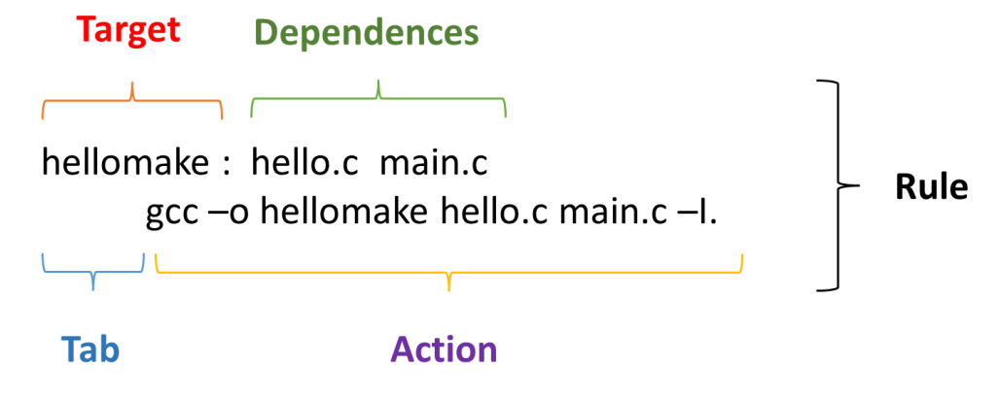

# 🧠 Lesson 1 – General Knowledge

##  1. Makefile

-  **Makefile** is a script that automates repetitive tasks such as compiling source code, linking libraries, and cleaning up build files. It is commonly used in **C/C++ projects** to simplify and standardize the build process.

- When you run the `make` command, the **make utility** reads the instructions inside the Makefile and executes the required actions automatically.

---

### Common Makefile Names

- Makefiles are typically named: **`Makefile, makefile, or *.mk`**

- If multiple names exist, GNU Make prioritizes `makefile` (lowercase), then `Makefile`.  
In practice, we often name it **Makefile** (with a capital "M") to make it stand out in the project directory.

You can specify a custom name using:
```bash
make -f custom_name.mk
```
### Structure of a Makefile

A Makefile consists of rules, and each rule follows this structure:




| Component    | Description                                                            |
| ------------ | ---------------------------------------------------------------------- |
| Target       | The file or action to create (e.g., an executable).            |
| Dependencies | The files or prerequisites required to build the target (e.g., .c and .h files).        |
| Action       | The shell commands executed to build the target (must start with a TAB, not spaces). |

**Example Syntax:**
```bash
make [ -f makefile ] [ options ] ... [ targets ] ...
```
**Common Make Options**

| Option    | Description                                                            |
| ------------ | ---------------------------------------------------------------------- |
| - f FILE      | FILE	Use a specific makefile.            |
| - i | Ignore all errors during execution.        |
| - n       | Print commands without executing them (dry run). |

**Common Targets**

| Target    | Purpose                                                            |
| ------------ | ---------------------------------------------------------------------- |
| all      | Build all main project targets.            |
| clean | Delete all compiled files and binaries.        |
| install / uninstall       | Copy or remove executables to/from system directories. |
| info  | Display build information. |
| tar  | Create a tar file of the source files |
| test  | Run project test cases. |

**Automatic Variables**

| Variable | Meaning                             |
| -------- | ----------------------------------- |
| $@       | The target filename.                |
| $<       | The first dependency.               |
| $^       | All dependencies.                   |
| $?       | Dependencies newer than the target. |
| $*       | The target without an extension.    |

**Variable Assignments**

| Operator Type | Description               |
| --------------| --------------------------|
| = (Recursive Assignment)     | Evaluated every time it’s used.    |
| := (Simple Assignment)       | Evaluated only once when defined.      |
| ?= (Conditional Assignment) | Assigned only if not already defined. |

**Example**

```mk
var := "value equals 1"
var3 := "hello"

var1 = $(var)
var2 := $(var)
var3 ?= $(var)

var := "value changes to 2"

all:
	@echo $(var1)
	@echo $(var2)
	@echo $(var3)
```

When we execuse the command:  
```
make all
```

We will have the following output
```
all
a.c
a.c b.c
a.c b.c
```

We can observe the following:  
- ```$@``` prints target of make command, in this case target is "all"
- ```$<``` prints the first dependency, which is "a.c" in this case
- ```$?``` and ```$^``` print all dependencies.

When we execuse the command:  

```
make rule3
```

We will have the following output:

```
value changes to 2
value equals 1
hello
```

- Since ```var1``` uses recursive assignment, eventhough ```var``` is updated to "value changes to 2" after assigning ```var``` to ```var1```, ```var1``` still has the latest value of ```var```
- ```var2``` uses simple assignment, so its value is set once. So it prints "value equals 1"
- ```var3``` uses conditional assignment, so program will check if ```var3``` already had any values, if yes, ```var3 ?= $(var)``` will not be executed, and ```var3``` has value assigned to it from the begining. Otherwise, ```var3 ?= $(var)``` will become recursive assignment.