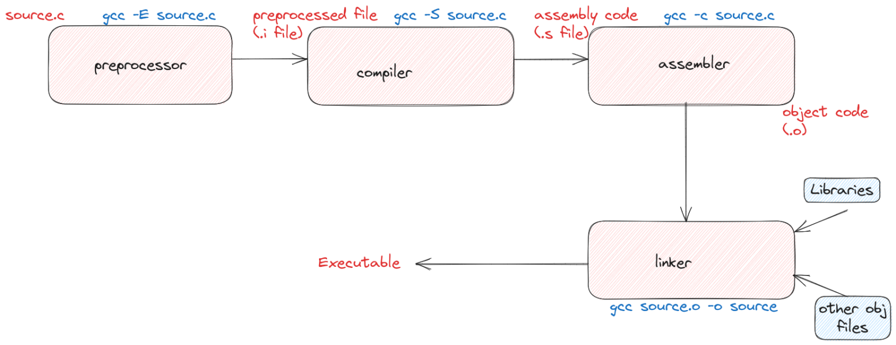

# 🧠 Lesson 1 – General Knowledge

##  1. Makefile

-  **Makefile** is a script that automates repetitive tasks such as compiling source code, linking libraries, and cleaning up build files. It is commonly used in **C/C++ projects** to simplify and standardize the build process.

- When you run the `make` command, the **make utility** reads the instructions inside the Makefile and executes the required actions automatically.

---

### Common Makefile Names

- Makefiles are typically named: **`Makefile, makefile, or *.mk`**

- If multiple names exist, GNU Make prioritizes `makefile` (lowercase), then `Makefile`.  
In practice, we often name it **Makefile** (with a capital "M") to make it stand out in the project directory.

You can specify a custom name using:
```bash
make -f custom_name.mk
```
### Structure of a Makefile

A Makefile consists of rules, and each rule follows this structure:


| Component    | Description                                                            |
| ------------ | ---------------------------------------------------------------------- |
| Target       | The file or action to create (e.g., an executable).            |
| Dependencies | The files or prerequisites required to build the target (e.g., .c and .h files).        |
| Action       | The shell commands executed to build the target (must start with a TAB, not spaces). |

**Example Syntax:**
```bash
make [ -f makefile ] [ options ] ... [ targets ] ...
```
**Common Make Options**

| Option    | Description                                                            |
| ------------ | ---------------------------------------------------------------------- |
| - f FILE      | FILE	Use a specific makefile.            |
| - i | Ignore all errors during execution.        |
| - n       | Print commands without executing them (dry run). |

**Common Targets**

| Target    | Purpose                                                            |
| ------------ | ---------------------------------------------------------------------- |
| all      | Build all main project targets.            |
| clean | Delete all compiled files and binaries.        |
| install / uninstall       | Copy or remove executables to/from system directories. |
| info  | Display build information. |
| tar  | Create a tar file of the source files |
| test  | Run project test cases. |

**Automatic Variables**

| Variable | Meaning                             |
| -------- | ----------------------------------- |
| $@       | The target filename.                |
| $<       | The first dependency.               |
| $^       | All dependencies.                   |
| $?       | Dependencies newer than the target. |
| $*       | The target without an extension.    |

**Variable Assignments**

| Operator Type | Description               |
| --------------| --------------------------|
| = (Recursive Assignment)     | Evaluated every time it’s used.    |
| := (Simple Assignment)       | Evaluated only once when defined.      |
| ?= (Conditional Assignment) | Assigned only if not already defined. |

**Example**

```mk
var := "value equals 1"
var3 := "hello"

var1 = $(var)
var2 := $(var)
var3 ?= $(var)

var := "value changes to 2"

all:
	@echo $(var1)
	@echo $(var2)
	@echo $(var3)
```

When we execuse the command:  
```
make all
```

We will have the following output
```
all
a.c
a.c b.c
a.c b.c
```

We can observe the following:  
- ```$@``` prints target of make command, in this case target is "all"
- ```$<``` prints the first dependency, which is "a.c" in this case
- ```$?``` and ```$^``` print all dependencies.

When we execuse the command:  

```
make rule3
```

We will have the following output:

```
value changes to 2
value equals 1
hello
```

- Since ```var1``` uses recursive assignment, eventhough ```var``` is updated to "value changes to 2" after assigning ```var``` to ```var1```, ```var1``` still has the latest value of ```var```
- ```var2``` uses simple assignment, so its value is set once. So it prints "value equals 1"
- ```var3``` uses conditional assignment, so program will check if ```var3``` already had any values, if yes, ```var3 ?= $(var)``` will not be executed, and ```var3``` has value assigned to it from the begining. Otherwise, ```var3 ?= $(var)``` will become recursive assignment.

## 2. The Process of Compiling a C Program



The process of converting a `.c` source file into an executable binary involves four main stages:

**1. Preprocessing**
- At the outset, the C preprocessor comes into play. 
- The preprocessor handles all lines starting with #, such as #include or #define.
- It expands macros and includes header files, producing an intermediate source file ready for compilation.

**2. Compilation**
- Once preprocessing is complete, the actual compilation commences.
- The compiler translates the preprocessed C code into assembly language, which is CPU-specific but still human-readable.
- Assembly code represents a low-level view of the program, consisting of instructions that the processor can execute.

**3. Assembly**
- The assembler converts assembly code into machine code, generating an object file `.o` that contains binary instructions.
- This step is a crucial bridge between human-readable code and the language the computer understands.

**4. Linking**
- The linker takes center stage. It resolves external dependencies, such as functions from libraries or other object files.
- Finally, the linker combines all object files `.o` and links them with libraries `.a` or `.so` to produce the final executable binary.
- The linker ensures that the final program is self-contained and ready to run.

## 3. Static vs Shared Libraries
**Static Library `.a`**
- A static library is directly linked into your program at compile time.
- All the code from the library is copied into the final executable, making it self-contained but larger.
- **Example:** Think of it as photocopying a chapter from another book and pasting it into your own. Now, your book has everything it needs, and you don't need the other book anymore.

**Shared Library `.so`**
- Not included in your program when you compile it.
- A shared library is loaded at runtime.
- Your program only keeps a reference to it, and multiple programs can share the same library in memory.
- **Example:** Instead of copying the chapter from another book into your own, you just reference where it can be found. When anyone reads your book still needs access to the other book.

|Feature	| Static Library	| Shared Library |
|-----------|-------------------|----------------|
|Executable size |	Larger (library code included) |	Smaller (code loaded at runtime)|
|Dependencies|	None needed at runtime|	Need the library to be available when your program runs.|
|Updates|	Requires recompilation|	Updated `.so` can be reused immediately|
|Performance|	Slightly faster startup|	Slightly slower load due to dynamic linking|

**Runtime:** refers to the entire period when a program is running, from the moment it starts until it finishes. During runtime:

- The program is loaded into memory.
- Any shared libraries or dependencies are resolved and loaded.
- The program executes its instructions.
- The program interacts with the operating system, hardware, or other resources.
- The program eventually terminates.

This is when the program is actively using the CPU, memory, and other resources. Runtime is about the environment and behavior of the program while it’s running.

**Execution time:** refers to the actual time taken by a program to run and complete its tasks. It is the period when the CPU is actively executing the program's instructions. Execution time is about performance measurement—how long it takes for the program to complete its tasks.

**Compile time:** is the phase when your source code (written in a high-level language like C, C++, Java, Python, ...) is translated into machine code (binary code) by a compiler.
