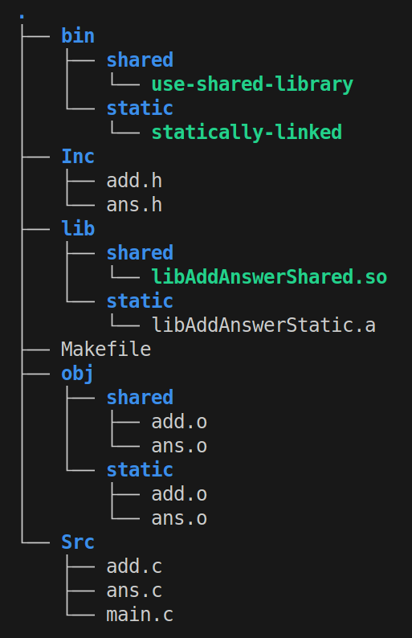

# Creating shared and static library

<ins>**Step 1**</ins>: Prepare folder tree following the below image

<ins>**Step 2**</ins>: In folder Inc -> add header files. In folder Src -> add source files and file main

- You can see example in folder "Ex1" 

<ins>**Step 3**</ins>: Prepare and explain Makefile
- ***CUR_DIR***: The current directory (. refers to the directory where the Makefile is located).
- ***SRC_DIR***: Directory which contain the source code files.
- ***INC_DIR***: Directory which contain header files.
- ***BIN_SHARED_DIR***: Directory where the final executable using the shared library will be placed.
- ***BIN_STATIC_DIR***: Directory where the final executable using the static library will be placed.
- ***OBJ_DIR***: Directory for object files (intermediate files generated during compilation).
- ***OBJ_SHARED_DIR***: Directory for object files used to build the shared library.
- ***OBJ_STATIC_DIR***: Directory for object files used to build the static library.
- ***LIB_DIR***: Directory where the libraries (static and shared) will be stored.
- ***LIB_SHARED_DIR***: Directory for the shared library (libAddAnswerShared.so).
- ***LIB_STATIC_DIR***: Directory for the static library (libAddAnswerStatic.a).
- ***C_FLAGS***: Compiler flags. Here, **-I$(INC_DIR)** tells the compiler to look for header files in the **INC_DIR** directory.
- ***Target <create_objs>***: This target compiles the source files (add.c, ans.c, main.c) into object files (.o).
Shared Library Objects:  
    - **fPIC**: Generates position-independent code, which is required for shared libraries; object files are placed in **OBJ_SHARED_DIR**.  
    - Static Library Objects: Object files are placed in **OBJ_STATIC_DIR**.  
    - Main Program Object: The **main.c** file is compiled into an object file and placed in **OBJ_DIR**.  
- ***Target <create_shared_lib>***: This target creates a shared library (libAddAnswerShared.so) from the object files (add.o and ans.o).  
    - **shared**: Tells the compiler to create a shared library. The library is placed in **LIB_SHARED_DIR**. 
- ***Target <create_static_lib>***: This target creates a static library (libAddAnswerStatic.a) from the object files (add.o and ans.o).  
    - **ar rcs**: The ar command is used to create static libraries. rcs stands for:  
    - **r**: Replace existing files in the archive.  
    - **c**: Create the archive if it doesn’t exist.  
    - **s**: Write an index into the archive.  
The library is placed in LIB_STATIC_DIR.  