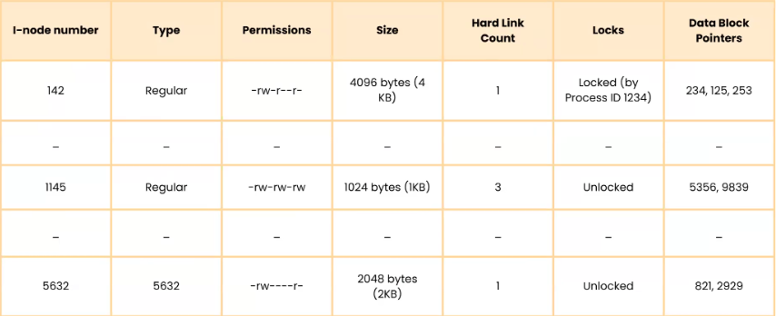
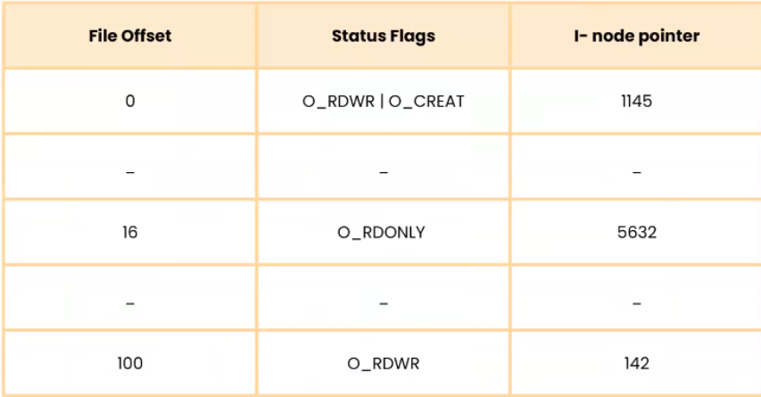
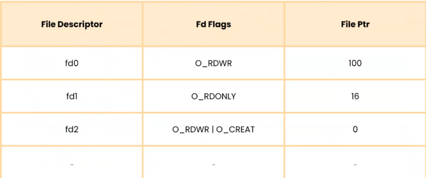
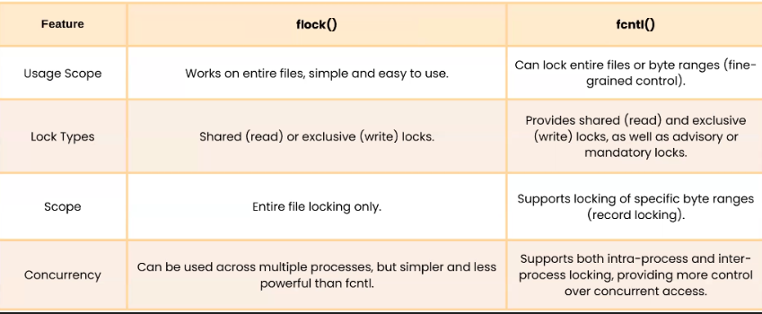

# Lesson 2 – Linux File System
## 1. Introduction
In Linux, everything is a file from regular text files to devices, sockets, and even processes.
This unified design allows the kernel and user programs to interact with almost any system resource through common file interfaces (`open`, `read`, `write`, etc.).

Types of Files in Linux
- **Regular file**: Normal file such as text file, executable file
- **Directories file**: File contains a list of other files.
- **Character device file**: File represents devices without memory address
- **Block device file**: File represents devices with memory address
- **Link files**: Represent another file
- **Socket file**: Represent for a Socket
- **Pipe file**: Represent for a Pipe
```bash
ls -l
```
This command lists all files and folders in the current folder.


- **1st column**: File type, file permission
    - 1st char: File type (i.e: d (directory))
        - `-`: Regular file	(-rw-r--r--)
        - `d`: Directory	(drwxr-xr-x)
        - `l`: Symbolic link	(lrwxrwxrwx)
        - `b`: Block device (e.g., disk)	(brw-r-----)
        - `c`: Character device (e.g., terminal)	(crw-rw----)
        - `p`: Named pipe (FIFO)	(prw-r--r--)
        - `s`: Socket (used for IPC)	srwxr-xr-x
    - 2-4 chars: Owner (user) permissions (i.e: rwx (read, write, execute))
    - 5-7 chars: Group permissions (i.e: r-x (read, execute))
    - 8-10 chars: Others (world) permissions (i.e: r-x (read, execute))
- **2nd column**: Number of hardlink of file
- **3rd column**: User name
- **4th column**: Group name

In Linux, the root user is the superuser (administrator) with unrestricted access to the entire system. The root account has the highest level of privileges. Linux follows a strict permission model to protect the system. Regular users have limited access, but root can bypass all security restrictions. That’s why misusing root privileges can accidentally break the system.

Switch to user root using command:
```bash
sudo su
```

Check if you are root:
```bash
whoami
```

In Linux, file permissions determine **who** can read, write, or execute a file. You can modify these permissions using the `chmod` (change mode) command.

The symbolic mode (chmod) allows you to specify:
- User categories:
    - `u` → User (Owner)
    - `g` → Group
    - `o` → Others
    - `a` → All (User, Group, Others)
- Operations:
    - `+` → Add a permission
    - `-` → Remove a permission
    - `=` → Set exact permissions
- Permissions:
    - `r` → Read
    - `w` → Write
    - `x` → Execute

Example:
```bash
chmod u+x file.txt   # Give execute permission to user (owner)
chmod g-w file.txt   # Remove write permission from group
chmod o+r file.txt   # Add read permission for others
chmod a-x file.txt   # Remove execute permission from everyone
chmod u=rw,g=r,o= file.txt  # Set exact permissions (user: rw, group: r, others: none)
```

The numeric mode assigns a 3-digit octal value:
- `4` → Read (r)
- `2` → Write (w)
- `1` → Execute (x)
- `0` → No permission

|Octal Value|	Permission|	Binary|	Symbolic|
|-----------|-------------|-------|---------|
|0|	No permission|	000	|---|
|1|	Execute|	001	|--x|
|2|	Write|	010	|-w-|
|3|	Write + Execute|	011	|-wx|
|4|	Read|	100	|r--|
|5|	Read + Execute|	101	|r-x|
|6|	Read + Write|	110	|rw-|
|7|	Read + Write + Execute|	111	|rwx|

```bash
chmod 755 file.txt  # rwxr-xr-x  (Owner: rwx, Group: r-x, Others: r-x)
chmod 644 file.txt  # rw-r--r--  (Owner: rw-, Group: r--, Others: r--)
chmod 777 file.txt  # rwxrwxrwx  (Full permissions)
chmod 600 file.txt  # rw-------  (Only owner can read/write)
chmod 400 file.txt  # r--------  (Only owner can read)
```

The chown (change owner) command in Linux is used to change the owner and/or group of a file or directory.

```bash
chown [OPTIONS] NEW_OWNER[:NEW_GROUP] FILE
```
- NEW_OWNER → The new user who will own the file.
- NEW_GROUP (optional) → The new group for the file.
- FILE → The target file or directory.

Example:
- Changing File Owner
```bash
sudo chown vortex myfile.txt
```
Changes the owner of myfile.txt to alice. Requires sudo (only root or the file owner can change ownership).

- Change File Group
```bash
sudo chown :manager myfile.txt
```
The `:` before the group name means only change the group. Now the group of `myfile.txt` is `manager`.

- Changing Both Owner and Group
```bash
sudo chown vortex:manager myfile.txt
```
Sets alice as the new owner and sets managers as the new group.

- Changing Ownership for Multiple Files
```bash
sudo chown -R kyle:staff /home/kyle/documents
```
`-R` (recursive) → Applies changes to all files and subdirectories. Now kyle owns all files inside /home/kyle/documents.

## 2. Read/Write to File

A system call (`syscall`) is a way for a user-space program (like a C program) to request a service from the Linux kernel.

Since user programs cannot directly access hardware (e.g., disk, memory, network), they use system calls to interact with the OS.

- User program makes a request (e.g., `open()`, `read()`, `write()`).
- The request switches from user mode → kernel mode.
- Kernel performs the requested operation (e.g., reading a file).
- The result is returned to the user program.

In Linux (and other operating systems), memory is divided into two spaces:
- **User Space** – Where user applications run.
- **Kernel Space** – Where the operating system (Linux kernel) runs.

**User space** is the part of system memory where regular programs (like `ls`, `vim`, `gcc`, `cd`, `mkdir`, `touch`, etc.) run. It has restricted access to system resources (CPU, memory, files). If a program needs to access hardware or system resources, it must request it through system calls.

**Kernel space** is where the Linux kernel runs and manages:
-  Process scheduling (which program runs and when)
- Memory management (allocating RAM to processes)
- Device drivers (handling hardware like disks, network, etc.)
- File system management
- Network communication

Kernel provides some basic system call functions such as:
`open()`, `read()`, `write()`, `lseek()`, `close()`

## 3. File Management

### Page Cache

The **page cache** is a region of main memory (RAM) that the Linux kernel uses to temporarily hold file data read from or written to the disk.  
Its purpose is to speed up I/O operations — because reading or writing data in RAM is far faster than interacting with physical storage.

#### How It Works

1. **Reading from a file**
   - When a process calls `read()`:
     - The kernel checks whether the requested file data already exists in the page cache.
       - **If found:** the data is returned directly from RAM (fast path).
       - **If not found:** a *page fault* occurs. The kernel fetches the data from disk, stores it in the page cache, then delivers it to the process.

2. **Writing to a file**
   - Data written by a process first goes into the page cache, not directly to disk.
   - The modified page is marked as **dirty** (meaning it differs from the version on disk).
   - The kernel later writes dirty pages to disk based on system policies or explicit calls like `sync()`.

#### Key Idea
The page cache serves as a “bridge” between slow disk access and fast RAM access.  
It improves performance by reusing recently accessed data and batching disk writes instead of doing them immediately.

---

### Inode Table

In Linux filesystems, every file or directory is described by a small record known as an **inode** (*index node*).  
The inode stores all of the file’s metadata — but not its content — and points to the physical blocks on disk where the data lives.

#### Information Stored in an Inode
- **File type:** regular file, directory, symbolic link, etc.  
- **Permissions:** read, write, execute bits for owner, group, and others.  
- **Ownership:** user ID (UID) and group ID (GID).  
- **Size:** total file size in bytes.  
- **Timestamps:**  
  - `ctime` – inode change time  
  - `mtime` – last content modification time  
  - `atime` – last access time  
- **Link count:** number of hard links to the inode.  
- **Pointers to data blocks:** addresses of actual file content on disk.

#### Inode Table Overview
- The **inode table** is a collection of all inodes for a given filesystem.
- It’s created during filesystem formatting and contains a fixed number of inode entries.
- When a new file is created, the kernel allocates a free inode and fills in its metadata.
- Each directory entry maps a **filename** to an **inode number**.

#### Lifecycle Example
- Opening a file → system finds its inode number from the directory entry.  
- Reading/writing → inode points to data blocks for access.  
- Deleting a file → directory entry is removed, and the inode’s link count decreases.  
  When it reaches zero, the inode and its data blocks are freed for reuse.


---
### Open File Table

The **open file table** is a kernel-level structure that tracks all files currently opened by any process in the system.  
It sits at the heart of Linux’s file management layer and ensures that multiple processes can share and access files consistently.

#### What It Does
Each entry in the open file table represents one active open instance of a file.  
The kernel uses this table to maintain runtime information such as:
- **File offset:** the current read/write position inside the file.  
- **Access mode:** whether the file is opened as read-only, write-only, or read/write.  
- **Reference count:** how many file descriptors currently point to this entry.

#### Key Concept
- A file first appears in the **inode table** when it’s created on disk.  
- It appears in the **open file table** only when a process actually opens it.  

This separation allows multiple processes to open the same file simultaneously while still maintaining their own independent file positions and access modes.



---

### File Descriptor Table

Every process in Linux has its own **file descriptor table**, a private data structure that records all files (and other I/O resources) that the process currently has open.  
While the open file table is shared system-wide, the file descriptor table exists **per process**.

Each entry in a file descriptor table maps:
- A small integer called a **file descriptor** (e.g., `0`, `1`, `2`, `3`, …)  
- To the corresponding entry in the **open file table**.

This design lets each process manage its own set of file handles without interfering with others.  
For example, `fd = 3` in one process might refer to a completely different file than `fd = 3` in another.



---

### Opening a File: Step-by-Step

When a process opens a file, the kernel performs a series of coordinated steps across these tables to connect the user process to the physical file on disk.

1. **System Call**  
   The process calls:
   ```c
   int fd = open("myfile.txt", O_RDONLY);
   ```
2. **Path Resolution**   
The kernel walks through the directory hierarchy to find `"myfile.txt"`.  
It retrieves the file’s inode number from the directory entry.

3. **Locate Inode**   
Using that inode number, the kernel looks up the corresponding entry in the inode table, which holds metadata such as:   
    - File type and permissions
    - Owner (UID, GID)
    - File size
    - Timestamps (`ctime`, `mtime`, `atime`)
    - Disk block pointers for the file’s data

4. **Create Open File Table Entry**   
The kernel allocates a new entry in the open file table, storing:

    - The current file offset (initially `0`)
    - The access mode (read, write, etc.)
    - The reference count (initially `1`)

5. **Update Process’s File Descriptor Table**   
    - A new entry is added to the process’s file descriptor table.
    - It maps the next available integer descriptor (e.g., `3`) to the new open file table entry.
    - The `open()` call returns this integer to the process.

6. **File Operations**  
When the process performs I/O (`read()`, `write()`, `lseek()`, etc.), the kernel:

    - Uses the file descriptor to locate the entry in the process’s descriptor table.
    - Follows that pointer to the open file table entry.
    - Then follows the inode reference to access the actual file data on disk.

7. **Closing the File**   
When the process calls `close(fd)`, the kernel:

    - Removes the entry from the process’s descriptor table.
    - Decreases the open file table entry’s reference count.
    - If the reference count reaches zero, the entry is freed from the open file table.

## 4 - File Locking

**File locking** is a mechanism that allows processes in Linux to coordinate access to files, preventing conflicts when multiple programs try to read or write the same data at once.  
It ensures that only one process — or a controlled group of processes — can access a file (or part of it) at a given moment, reducing the risk of **data corruption** or **inconsistency**.

This mechanism is especially important in applications that perform concurrent operations, such as databases, log writers, or shared configuration systems.



---

### Synchronization vs Asynchronization

Before diving deeper into locking, it’s helpful to distinguish between **synchronous** and **asynchronous** execution — two different ways processes can coordinate (or not) when accessing shared resources.

#### Synchronization
- Means ***coordinated execution***: one process may need to wait for another to finish before proceeding.  
- Ensures that shared data is accessed in a controlled and predictable order.  
- Typically relies on mechanisms such as **locks**, **semaphores**, or **barriers**.  
- Prevents race conditions and corruption but can reduce performance if many processes are waiting on each other.

#### Asynchronization
- Means ***independent execution***: tasks can start, run, and complete at different times without waiting for others.  
- Execution order isn’t strictly defined — often event-driven or callback-based.  
- Great for tasks like I/O operations or user interfaces, where waiting would waste time.  
- Can increase concurrency but also makes debugging and reasoning about order more complex.

---

### Comparison Table

| **Aspect** | **Synchronization** | **Asynchronization** |
|-------------|----------------------|----------------------|
| **Execution Model** | Blocking – tasks may wait for others to finish. | Non-blocking – tasks run independently. |
| **Order of Execution** | Strict and predictable. | Unordered or event-driven. |
| **Resource Sharing** | Requires locks, semaphores, or barriers. | No explicit coordination needed. |
| **Concurrency** | Limited due to waiting for shared resources. | High – tasks can overlap in time. |
| **Common Use Cases** | Multi-threaded programs, shared data access. | I/O-bound tasks, event-driven systems, responsive UIs. |
| **Complexity** | Risk of deadlocks or race conditions. | Harder to debug due to non-linear flow. |
| **Performance** | May be slower because of blocking or waiting. | Often faster and more responsive. |

---

### Summary

In Linux, **file locking** acts as a synchronization tool that controls concurrent file access.  
It allows processes to share files safely by defining ***who can access what and when***.  
By combining file locks with proper synchronization strategies, systems can maintain consistency and integrity even under heavy parallel workloads.
