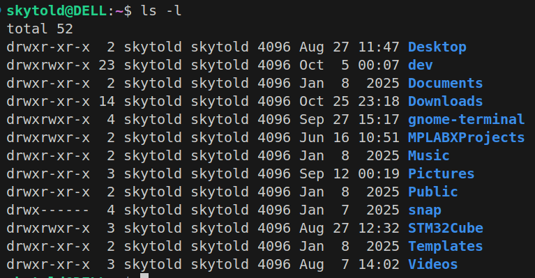

# Lesson 2 – Linux File System
## 1. Introduction
In Linux, everything is a file from regular text files to devices, sockets, and even processes.
This unified design allows the kernel and user programs to interact with almost any system resource through common file interfaces (`open`, `read`, `write`, etc.).

Types of Files in Linux
- **Regular file**: Normal file such as text file, executable file
- **Directories file**: File contains a list of other files.
- **Character device file**: File represents devices without memory address
- **Block device file**: File represents devices with memory address
- **Link files**: Represent another file
- **Socket file**: Represent for a Socket
- **Pipe file**: Represent for a Pipe
```bash
ls -l
```
This command lists all files and folders in the current folder.


- **1st column**: File type, file permission
    - 1st char: File type (i.e: d (directory))
        - `-`: Regular file	(-rw-r--r--)
        - `d`: Directory	(drwxr-xr-x)
        - `l`: Symbolic link	(lrwxrwxrwx)
        - `b`: Block device (e.g., disk)	(brw-r-----)
        - `c`: Character device (e.g., terminal)	(crw-rw----)
        - `p`: Named pipe (FIFO)	(prw-r--r--)
        - `s`: Socket (used for IPC)	srwxr-xr-x
    - 2-4 chars: Owner (user) permissions (i.e: rwx (read, write, execute))
    - 5-7 chars: Group permissions (i.e: r-x (read, execute))
    - 8-10 chars: Others (world) permissions (i.e: r-x (read, execute))
- **2nd column**: Number of hardlink of file
- **3rd column**: User name
- **4th column**: Group name

In Linux, the root user is the superuser (administrator) with unrestricted access to the entire system. The root account has the highest level of privileges. Linux follows a strict permission model to protect the system. Regular users have limited access, but root can bypass all security restrictions. That’s why misusing root privileges can accidentally break the system.

Switch to user root using command:
```bash
sudo su
```

Check if you are root:
```bash
whoami
```

In Linux, file permissions determine **who** can read, write, or execute a file. You can modify these permissions using the `chmod` (change mode) command.

The symbolic mode (chmod) allows you to specify:
- User categories:
    - `u` → User (Owner)
    - `g` → Group
    - `o` → Others
    - `a` → All (User, Group, Others)
- Operations:
    - `+` → Add a permission
    - `-` → Remove a permission
    - `=` → Set exact permissions
- Permissions:
    - `r` → Read
    - `w` → Write
    - `x` → Execute

Example:
```bash
chmod u+x file.txt   # Give execute permission to user (owner)
chmod g-w file.txt   # Remove write permission from group
chmod o+r file.txt   # Add read permission for others
chmod a-x file.txt   # Remove execute permission from everyone
chmod u=rw,g=r,o= file.txt  # Set exact permissions (user: rw, group: r, others: none)
```

The numeric mode assigns a 3-digit octal value:
- `4` → Read (r)
- `2` → Write (w)
- `1` → Execute (x)
- `0` → No permission

|Octal Value|	Permission|	Binary|	Symbolic|
|-----------|-------------|-------|---------|
|0|	No permission|	000	|---|
|1|	Execute|	001	|--x|
|2|	Write|	010	|-w-|
|3|	Write + Execute|	011	|-wx|
|4|	Read|	100	|r--|
|5|	Read + Execute|	101	|r-x|
|6|	Read + Write|	110	|rw-|
|7|	Read + Write + Execute|	111	|rwx|

```bash
chmod 755 file.txt  # rwxr-xr-x  (Owner: rwx, Group: r-x, Others: r-x)
chmod 644 file.txt  # rw-r--r--  (Owner: rw-, Group: r--, Others: r--)
chmod 777 file.txt  # rwxrwxrwx  (Full permissions)
chmod 600 file.txt  # rw-------  (Only owner can read/write)
chmod 400 file.txt  # r--------  (Only owner can read)
```

The chown (change owner) command in Linux is used to change the owner and/or group of a file or directory.

```bash
chown [OPTIONS] NEW_OWNER[:NEW_GROUP] FILE
```
- NEW_OWNER → The new user who will own the file.
- NEW_GROUP (optional) → The new group for the file.
- FILE → The target file or directory.

Example:
- Changing File Owner
```bash
sudo chown vortex myfile.txt
```
Changes the owner of myfile.txt to alice. Requires sudo (only root or the file owner can change ownership).

- Change File Group
```bash
sudo chown :manager myfile.txt
```
The `:` before the group name means only change the group. Now the group of `myfile.txt` is `manager`.

- Changing Both Owner and Group
```bash
sudo chown vortex:manager myfile.txt
```
Sets alice as the new owner and sets managers as the new group.

- Changing Ownership for Multiple Files
```bash
sudo chown -R kyle:staff /home/kyle/documents
```
`-R` (recursive) → Applies changes to all files and subdirectories. Now kyle owns all files inside /home/kyle/documents.

## 2 - Read/Write to File

A system call (`syscall`) is a way for a user-space program (like a C program) to request a service from the Linux kernel.

Since user programs cannot directly access hardware (e.g., disk, memory, network), they use system calls to interact with the OS.

- User program makes a request (e.g., `open()`, `read()`, `write()`).
- The request switches from user mode → kernel mode.
- Kernel performs the requested operation (e.g., reading a file).
- The result is returned to the user program.

In Linux (and other operating systems), memory is divided into two spaces:
- **User Space** – Where user applications run.
- **Kernel Space** – Where the operating system (Linux kernel) runs.

**User space** is the part of system memory where regular programs (like `ls`, `vim`, `gcc`, `cd`, `mkdir`, `touch`, etc.) run. It has restricted access to system resources (CPU, memory, files). If a program needs to access hardware or system resources, it must request it through system calls.

**Kernel space** is where the Linux kernel runs and manages:
-  Process scheduling (which program runs and when)
- Memory management (allocating RAM to processes)
- Device drivers (handling hardware like disks, network, etc.)
- File system management
- Network communication

Kernel provides some basic system call functions such as:
`open()`, `read()`, `write()`, `lseek()`, `close()`

